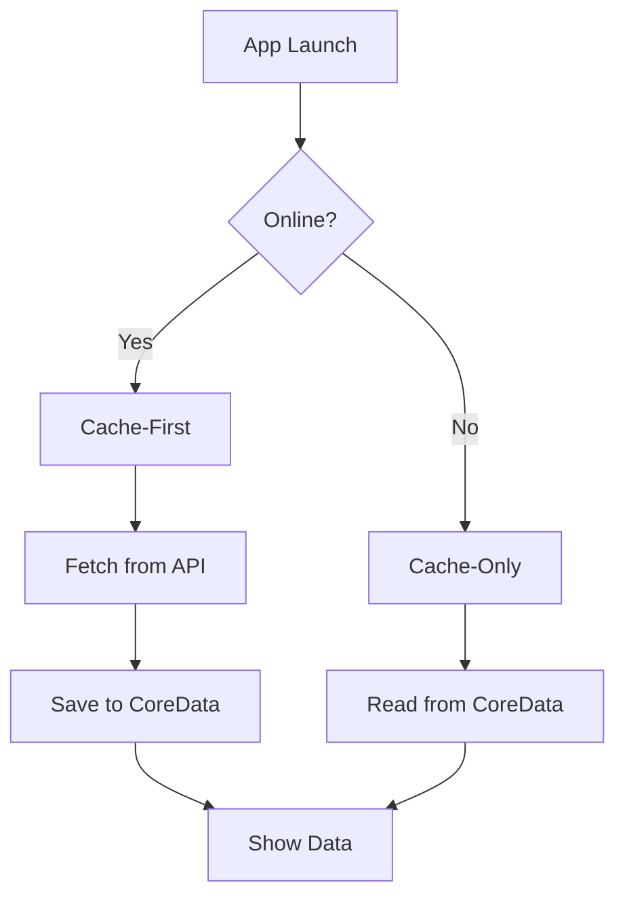

# Offline Mode Architecture

## AeroXe Nexus AI — iOS Offline-First Design

**Version: 1.0 | Last Updated: July 2026**

---

# Table of Contents

1. [Offline Architecture Overview](#1-offline-architecture-overview)
2. [CoreData Stack Configuration](#2-coredata-stack-configuration)
3. [CoreData Entities](#3-coredata-entities)
4. [CoreData Fetch Requests](#4-coredata-fetch-requests)
5. [CoreData Save Operations](#5-coredata-save-operations)
6. [CoreData Migrations](#6-coredata-migrations)
7. [UserDefaults](#7-userdefaults)
8. [Keychain](#8-keychain)
9. [Offline Cache Strategy](#9-offline-cache-strategy)
10. [SyncEngine Architecture](#10-syncengine-architecture)
11. [Conflict Resolution](#11-conflict-resolution)
12. [Sync Queue](#12-sync-queue)
13. [Sync Status Indicators](#13-sync-status-indicators)
14. [BGTaskScheduler Configuration](#14-bigtaskscheduler-configuration)
15. [Background Sync](#15-background-sync)
16. [Offline Chat](#16-offline-chat)
17. [Offline Document Upload](#17-offline-document-upload)
18. [Offline Search](#18-offline-search)
19. [Offline Data Freshness](#19-offline-data-freshness)
20. [Offline Mode Toggle](#20-offline-mode-toggle)
21. [Offline Storage Limits](#21-offline-storage-limits)
22. [Offline Data Encryption](#22-offline-data-encryption)
23. [Offline Testing](#23-offline-testing)
24. [Offline UX Patterns](#24-offline-ux-patterns)
25. [Offline Error Handling](#25-offline-error-handling)
26. [Offline Performance](#26-offline-performance)
27. [Offline Accessibility](#27-offline-accessibility)

---

# 1. Offline Architecture Overview

The offline architecture follows an **offline-first** pattern where the local CoreData database is the single source of truth. All data operations read/write through CoreData first, with a SyncEngine reconciling with the backend when connectivity is restored.

```
┌──────────────────────────────────────────────────────────┐
│                    SwiftUI Layer                          │
│  (Views observe @Published ViewModels)                    │
└────────────────────┬─────────────────────────────────────┘
                     │
┌────────────────────▼─────────────────────────────────────┐
│                ViewModel Layer                            │
│  (Business logic, state management, Combine pipelines)    │
└────────────────────┬─────────────────────────────────────┘
                     │
┌────────────────────▼─────────────────────────────────────┐
│              Repository Layer                              │
│  (Data source abstraction: local vs remote)                │
└──────┬──────────────────────────────┬─────────────────────┘
       │                              │
┌──────▼──────────────┐  ┌───────────▼─────────────────────┐
│   CoreData Store    │  │     Remote API Service           │
│  (Local Source of   │  │  (REST/gRPC calls)              │
│   Truth)            │  │                                  │
└──────┬──────────────┘  └───────────┬─────────────────────┘
       │                              │
┌──────▼──────────────────────────────▼─────────────────────┐
│                    SyncEngine                              │
│  (Conflict resolution, queue management, delta sync)      │
└──────┬──────────────────────────────┬─────────────────────┘
       │                              │
┌──────▼──────────────┐  ┌───────────▼─────────────────────┐
│  BGTaskScheduler    │  │   NWPathMonitor                   │
│  (Background sync)  │  │  (Connectivity detection)        │
└─────────────────────┘  └─────────────────────────────────┘
```

## Core Components

| Component | Role |
|-----------|------|
| `CoreDataStack` | Singleton managing `NSPersistentContainer`, contexts, migrations |
| `SyncEngine` | Orchestrates data sync between CoreData and remote API |
| `SyncQueue` | Persists pending operations for later execution |
| `ConnectivityService` | Wraps `NWPathMonitor` to observe network state |
| `BgTaskService` | Registers and schedules background refresh tasks |
| `OfflineCacheManager` | Controls cache eviction, storage limits, encryption |

---

# 2. CoreData Stack Configuration

## NSPersistentContainer Setup

```swift
import CoreData

final class CoreDataStack {
    static let shared = CoreDataStack()

    private let containerName = "NexusAIModel"
    private var appGroupID: String { "group.com.aeroxe.nexus-ai" }

    lazy var persistentContainer: NSPersistentCloudKitContainer = {
        let container = NSPersistentContainer(name: containerName)

        let storeURL = FileManager.default
            .containerURL(forSecurityApplicationGroupIdentifier: appGroupID)!
            .appendingPathComponent("\(containerName).sqlite")

        let description = NSPersistentStoreDescription(url: storeURL)
        configuration(for: description)

        container.persistentStoreDescriptions = [description]
        container.loadPersistentStores { _, error in
            if let error {
                fatalError("Failed to load store: \(error)")
            }
        }
        container.viewContext.configureForViewUsage()
        return container
    }()

    private func configuration(for description: NSPersistentStoreDescription) {
        description.shouldMigrateStoreAutomatically = true
        description.shouldInferMappingModelAutomatically = true
        description.isReadOnly = false
        description.setOption(true as NSNumber,
                              forKey: NSPersistentHistoryTrackingKey)
        description.setOption(true as NSNumber,
                              forKey: NSPersistentRemoteChangeNotificationPostOptionKey)
    }
}

extension NSManagedObjectContext {
    func configureForViewUsage() {
        automaticallyMergesChangesFromParent = true
        mergePolicy = NSMergePolicy.mergeByPropertyStoreTrump
    }
}
```

## Context Hierarchy

| Context | Queue | Purpose |
|---------|-------|---------|
| `viewContext` | Main | UI reads/writes via `@FetchRequest`, lightweight saves |
| `backgroundContext()` | Private | JSON ingestion, batch updates, sync operations |

## Managed Object Model

```
┌────────────────────────────────────────────────────�-Model.xml
│
│  Entities:
│  ┌────────────┐  ┌────────────┐  ┌────────────┐
│  │Conversation │  │  Message   │  │ Documents  │
│  ├────────────┤  ├────────────┤  ├────────────┤
│  │ id: UUID   │  │ id: UUID   │  │ id: UUID   │
│  │ title      │  │ content    │  │ filename   │
│  │ updatedAt  │  │ role: Int16│  │ status     │
│  │ syncStatus │  │ createdAt  │  │ fileSize   │
│  │ isArchived │  │ syncStatus │  │ mimeType   │
│  └─────┬──────┘  └──────┬─────┘  │ checksum   │
│        │                │         │ syncStatus │
│        │ oneToMany      │         └────────────┘
│        └────────────────┘
│
│  ┌────────────┐  ┌─────────────────┐
│  │   Agent    │  │ UserPreferences  │
│  ├────────────┤  ├─────────────────┤
│  │ id: UUID   │  │ key: String     │
│  │ name       │  │ value: Data     │
│  │ type       │  │ updatedAt       │
│  │ status     │  │ syncStatus      │
│  │ syncStatus │  └─────────────────┘
│  └────────────┘
└────────────────────────────────────────────────────
```

---

# 3. CoreData Entities

## Conversation Entity

```swift
@objc(Conversation)
public class Conversation: NSManagedObject {
    @NSManaged public var id: UUID
    @NSManaged public var title: String
    @NSManaged public var createdAt: Date
    @NSManaged public var updatedAt: Date
    @NSManaged public var syncStatus: SyncStatusValue
    @NSManaged public var isArchived: Bool
    @NSManaged public var messages: Set<Message>?
    @NSManaged public var agent: Agent?

    static func fetchPredicate(notArchived: Bool) -> NSPredicate {
        NSPredicate(format: "isArchived == %@", NSNumber(value: !notArchived))
    }
}
```

## Message Entity

```swift
@objc(Message)
public class Message: NSManagedObject {
    @NSManaged public var id: UUID
    @NSManaged public var content: String
    @NSManaged public var role: MessageRoleValue  // 0=user, 1=assistant, 2=system
    @NSManaged public var createdAt: Date
    @NSManaged public var syncStatus: SyncStatusValue
    @NSManaged public var conversation: Conversation?

    enum MessageRoleValue: Int16 {
        case user = 0
        case assistant = 1
        case system = 2
    }
}
```

## Document Entity

```swift
@objc(Document)
public class Document: NSManagedObject {
    @NSManaged public var id: UUID
    @NSManaged public var filename: String
    @NSManaged public var status: DocumentStatusValue
    @NSManaged public var fileSize: Int64
    @NSManaged public var mimeType: String
    @NSManaged public var checksum: String
    @NSManaged public var localURL: String?
    @NSManaged public var syncStatus: SyncStatusValue
    @NSManaged public var createdAt: Date
}
```

## Agent Entity

```swift
@objc(Agent)
public class Agent: NSManagedObject {
    @NSManaged public var id: UUID
    @NSManaged public var name: String
    @NSManaged public var agentType: AgentTypeValue
    @NSManaged public var status: AgentStatusValue
    @NSManaged public var configData: Data?
    @NSManaged public var syncStatus: SyncStatusValue
    @NSManaged public var conversations: Set<Conversation>?
}
```

## UserPreferences Entity

```swift
@objc(UserPreferences)
public class UserPreferences: NSManagedObject {
    @NSManaged public var key: String
    @NSManaged public var value: Data
    @NSManaged public var updatedAt: Date
    @NSManaged public var syncStatus: SyncStatusValue
}
```

## SyncStatus Enum

```swift
@objc enum SyncStatusValue: Int16 {
    case synced = 0
    case pendingCreate = 1
    case pendingUpdate = 2
    case pendingDelete = 3
    case syncing = 4
    case failed = 5
}
```

## Entity Relationship Map

| Entity | Relationship | Inverse | Cardinality |
|--------|-------------|---------|-------------|
| Conversation | messages | conversation | one-to-many |
| Message | conversation | messages | many-to-one |
| Conversation | agent | conversations | many-to-one |
| Agent | conversations | agent | one-to-many |

---

# 4. CoreData Fetch Requests

## Basic FetchRequest

```swift
extension Conversation {
    static func allConversations(
        sortedBy date: Bool = true,
        archived: Bool = false
    ) -> NSFetchRequest<Conversation> {
        let request = NSFetchRequest<Conversation>(entityName: "Conversation")
        request.predicate = NSPredicate(format: "isArchived == %@", NSNumber(value: archived))
        request.sortDescriptors = [
            NSSortDescriptor(key: "updatedAt", ascending: !date)
        ]
        request.fetchBatchSize = 20
        return request
    }
}
```

## Using Compound Predicates

```swift
static func fetchSyncingItems() -> NSFetchRequest<any NSManagedObject> {
    let request = NSFetchRequest<any NSManagedObject>(entityName: "Conversation")
    request.predicate = NSPredicate(
        format: "syncStatus IN %@",
        [SyncStatusValue.pendingCreate.rawValue,
         SyncStatusValue.pendingUpdate.rawValue,
         SyncStatusValue.failed.rawValue]
    )
    return request
}
```

## SwiftUI @FetchRequest Usage

```swift
struct ConversationListView: View {
    @FetchRequest(
        sortDescriptors: [SortDescriptor(\.updatedAt, order: .reverse)],
        predicate: NSPredicate(format: "isArchived == false"),
        animation: .default
    ) private var conversations: FetchedResults<Conversation>

    var body: some View {
        List(conversations) { conversation in
            ConversationRowView(conversation: conversation)
        }
    }
}
```

## NSFetchRequest Configuration Options

| Parameter | Example | Effect |
|-----------|---------|--------|
| `fetchBatchSize` | 20 | Reduces memory by faulting objects in batches |
| `fetchLimit` | 100 | Caps total results |
| `relationshipKeyPathsForPrefetching` | `["messages"]` | Fires relationship faults immediately |
| `includesPendingChanges` | `false` | Excludes unsaved changes from fetch |

---

# 5. CoreData Save Operations

## View Context Save

```swift
extension NSManagedObjectContext {
    func nexusSave() async throws {
        guard hasChanges else { return }

        let insertCount = insertedObjects.count
        let updateCount = updatedObjects.count
        let deleteCount = deletedObjects.count

        os_log(.debug, "Saving context: +%d ~%d -%d",
               insertCount, updateCount, deleteCount)

        try save()
    }
}
```

## Background Context Operations

```swift
final class SyncEngine {
    private let stack = CoreDataStack.shared

    func backgroundOperation<T>(
        _ block: @escaping (NSManagedObjectContext) throws -> T
    ) async throws -> T {
        let context = stack.persistentContainer.newBackgroundContext()
        context.mergePolicy = NSMergePolicy.mergeByPropertyStoreTrump

        return try await withCheckedThrowingContinuation { continuation in
            context.perform {
                do {
                    let result = try block(context)
                    try context.save()
                    continuation.resume(returning: result)
                } catch {
                    continuation.resume(throwing: error)
                }
            }
        }
    }
}
```

## Bulk Import Pattern

```swift
func bulkImportConversations(_ dtos: [ConversationDTO]) async throws {
    try await backgroundOperation { context in
        for (index, dso) in dtos.enumerated() {
            let conversation = Conversation(context: context)
            conversation.id = dto.id
            conversation.title = dto.title
            conversation.createdAt = dto.createdAt
            conversation.updatedAt = dto.updatedAt
            conversation.syncStatus = .synced

            if index % 50 == 0 {
                try context.save()
                context.reset()
            }
        }
        try context.save()
    }
}
```

## Save Operation Types

| Context | Queue | When |
|---------|-------|------|
| `viewContext` | Main | User edits, toggle archive, UI-driven mutations |
| `newBackgroundContext()` | Private | API response ingestion, sync processing |

---

# 6. CoreData Migrations

## Lightweight Migration

CoreData infers lightweight migrations automatically for:
- Adding/removing optional attributes
- Adding/removing optional relationships
- Renaming attributes via `NSEntityMapping` with rename identifier

```swift
let description = NSPersistentStoreDescription(url: storeURL)
description.shouldMigrateStoreAutomatically = true
description.shouldInferMappingModelAutomatically = true
```

## Heavyweight Migration

When lightweight migration is insufficient (non-optional to optional, splitting entities):

```swift
// HeavyweightMigrationManager.swift
final class HeavyweightMigrationManager {
    static func migrate(
        from sourceModel: NSManagedObjectModel,
        to destinationModel: NSManagedObjectModel,
        storeURL: URL
    ) throws {
        let mappingModel: NSMappingModel

        if let model = NSMappingModel(
            from: Bundle.main,
            forSourceModel: sourceModel,
            destinationModel: destinationModel
        ) {
            mappingModel = model
        } else {
            mappingModel = try NSMappingModel.inferredMappingModel(
                forSourceModel: sourceModel,
                destinationModel: destinationModel
            )
        }

        let manager = NSMigrationManager(
            sourceModel: sourceModel,
            destinationModel: destinationModel
        )

        let destinationURL = storeURL.deletingPathExtension()
            .appendingPathExtension("tmp.sqlite")

        try manager.migrateStore(
            from: storeURL,
            sourceType: NSSQLiteStoreType,
            options: nil,
            with: mappingModel,
            toDestinationURL: destinationURL,
            destinationType: NSSQLiteStoreType,
            destinationOptions: nil
        )

        try NSPersistentStoreCoordinator
            .replaceStore(at: storeURL,
                          withStoreAt: destinationURL)
    }
}
```

## Migration version table

| Model Version | Changes | Migration Type |
|---------------|---------|----------------|
| v1 (initial) | — | — |
| v2 | Added `UserPreferences` entity | Lightweight |
| v3 | Added `checksum` to Document | Lightweight |
| v4 | Made `title` non-optional | Heavyweight |

---

# 7. UserDefaults

## Keys & Organization

```swift
enum UserDefaultsKeys {
    static let offlineModeEnabled = "kOfflineModeEnabled"
    static let theme = "kTheme"
    static let language = "kLanguage"
    static let cacheLimitMB = "kCacheLimitMB"
    static let biometricEnabled = "kBiometricEnabled"
    static let onboardingComplete = "kOnboardingComplete"
    static let lastSyncDate = "kLastSyncDate"
    static let syncIntervalMinutes = "kSyncIntervalMinutes"
    static let maxCacheSize = "kMaxCacheSize"
}
```

## UserDefaults Manager

```swift
final class AppSettings {
    private let defaults = UserDefaults.standard

    static let shared = AppSettings()

    var isOfflineModeEnabled: Bool {
        get { defaults.bool(forKey: UserDefaultsKeys.offlineModeEnabled) }
        set { defaults.set(newValue, forKey: UserDefaultsKeys.offlineModeEnabled) }
    }

    var theme: ThemeStyle {
        get {
            let raw = defaults.string(forKey: UserDefaultsKeys.theme) ?? "auto"
            return ThemeStyle(rawValue: raw) ?? .auto
        }
        set { defaults.set(newValue.rawValue, forKey: UserDefaultsKeys.theme) }
    }

    var language: Language {
        get {
            let raw = defaults.string(forKey: UserDefaultsKeys.language) ?? "en"
            return Language(rawValue: raw) ?? .english
        }
        set { defaults.set(newValue.rawValue, forKey: UserDefaultsKeys.language) }
    }

    var lastSyncDate: Date? {
        get { defaults.object(forKey: UserDefaultsKeys.lastSyncDate) as? Date }
        set { defaults.set(newValue, forKey: UserDefaultsKeys.lastSyncDate) }
    }
}
```

| Setting | Type | Default | Persisted |
|---------|------|---------|-----------|
| offlineModeEnabled | Bool | true | UserDefaults |

---

# 8. Keychain

## Keychain Service

```swift
import Security

final class KeychainService {
    static let shared = KeychainService()

    private let serviceName = "com.aeroxe.nexus-ai.keychain"
    private let accessGroup = "group.com.aeroxe.nexus-ai"

    enum KeychainKey: String {
        case authToken
        case refreshToken
        case devicePrivateKey
        case userPIN
    }

    func store(_ data: Data, key: KeychainKey) throws {
        var query: [String: Any] = [
            kSecClass as String: kSecClassGenericPassword,
            kSecAttrService as String: serviceName,
            kSecAttrAccount as String: key.rawValue,
            kSecAttrAccessGroup as String: accessGroup,
            kSecValueData as String: data,
            kSecAttrAccessible as String: kSecAttrAccessibleWhenUnlockedThisDeviceOnly,
        ]

        SecItemDelete(query as CFDictionary)
        let status = SecItemAdd(query as CFDictionary, nil)
        guard status == errSecSuccess else {
            throw KeychainError.storeFailed(status: status)
        }
    }

    func read(key: KeychainKey) throws -> Data {
        let query: [String: Any] = [
            kSecClass as String: kSecClassGenericPassword,
            kSecAttrService as String: serviceName,
            kSecAttrAccount as String: key.rawValue,
            kSecAttrAccessGroup as String: accessGroup,
            kSecReturnData as String: true,
            kSecMatchLimit as String: kSecMatchLimitOne,
        ]

        var result: AnyObject?
        let status = SecItemCopyMatching(query as CFDictionary, &result)
        guard status == errSecSuccess, let data = result as? Data else {
            throw KeychainError.readFailed(status: status)
        }
        return data
    }

    func delete(key: KeychainKey) throws {
        let query: [String: Any] = [
            kSecClass as String: kSecClassGenericPassword,
            kSecAttrService as String: serviceName,
            kSecAttrAccount as String: key.rawValue,
            kSecAttrAccessGroup as String: accessGroup,
        ]
        let status = SecItemDelete(query as CFDictionary)
        guard status == errSecSuccess || status == errSecItemNotFound else {
            throw KeychainError.deleteFailed(status: status)
        }
    }
}

enum KeychainError: LocalizedError {
    case storeFailed(status: OSStatus)
    case readFailed(status: OSStatus)
    case deleteFailed(status: OSStatus)

    var errorDescription: String? {
        switch self {
        case .storeFailed(let status):
            return "Keychain store failed: \(status)"
        case .readFailed(let status):
            return "Keychain read failed: \(status)"
        case .deleteFailed(let status):
            return "Keychain delete failed: \(status)"
        }
    }
}
```

## Token Storage

| Data | Keychain Key | Accessibility |
|------|-------------|---------------|
| Auth Token | authToken | kSecAttrAccessibleWhenUnlockedThisDeviceOnly |

---

# 8. Offline Cache Strategy

The offline mode uses a **varied strategy based on data type**.



## Strategy Matrix

| Data Type | Strategy | reason |
|--------|----------|--------|
| Conversations | Cache-first | Show cached, update in background |
| Messages | Cache-first | near-real-time chat, full history from cache |
| Documents | Network-first | files are large, cache metadata only |
| Agents | Cache-first | agents change infrequently |
| User Settings | Cache-only | always read from local |
| Search Results | Cache-only (local) | no network fallback |

---

# 10. SyncEngine Architecture

```swift
actor SyncEngine {
    static let shared = SyncEngine()
    private let stack = CoreDataStack.shared
    private let api = NexusAPIClient.shared
    private let connectivity = ConnectivityService.shared

    enum SyncPhase {
        case idle, syncing, failed(Error)
    }

    private(set) var phase: SyncPhase = .idle
    var onPhaseChange: AsyncStream<SyncPhase> {
        AsyncStream { continuation in
            // observe changes
        }
    }

    func performSync() async {
        phase = .syncing

        do {
            // 1. push local changes
            try await pushPendingChanges()

            // 2. fetch remote changes
            try await fetchRemoteChanges()

            // 3. reconcile
            try await reconcileConflicts()

            phase = .idle
            AppSettings.shared.lastSyncDate = Date()
        } catch {
            phase = .failed(error)
        }
    }
}
```

## Full Sync Sequence

```
Time    Client (Local)              Server (Remote)
 │      ┌─────────────┐             ┌──────────────┐
 │      │ 1. Collect  │             │              │
 │      │ pending ops │             │              │
 │      └──────┬──────┘             │              │
 │             │                    │              │
 │      ┌──────▼──────┐             │              │
 │      │ 2. GET /sync│────────────►│ Return       │
 │      │ (since date)│◄────────────│ changes      │
 │      └──────┬──────┘             │              │
 │             │                    │              │
 │      ┌──────▼──────┐             │              │
 │      │ 3. PUSH ops │────────────►│              │
 │      │ via POST    │◄────────────│ 200 OK / err │
 │      └──────┬──────┘             │              │
 │             │                    │              │
 │      ┌──────▼──────┐             │              │
 │      │ 4. Reconcile│             │              │
 │      │ conflicts   │             │              │
 │      └─────────────┘             │              │
 ▼                                  ▼
```

---

# 11. Conflict Resolution

## Conflict Policy Table

| Entity | Policy | Behavior |
|--------|--------|----------|
| Messages | Last-write-wins | latest `createdAt` wins |
| Conversations | Merge | Merge updatedAt and title |
| Documents | Last-write-wins | Overwrite local with remote |
| UserPreferences | Last-write-wins | Server-side wins |

## Conflict Handler

```swift
final class ConflictResolver {
    enum Resolution {
        case useLocal
        case useRemote
        case merge(NSManagedObject)
        case promptUser
    }

    func resolve<T: NSManagedObject>(
        local: T,
        remote: T,
        entityName: String
    ) -> Resolution {
        switch entityName {
        case "Message":
            return resolveMessageConflict(local: local as! Message,
                                          remote: remote as! Message)
        case "Conversation":
            return resolveConversationConflict(local: local as! Conversation,
                                                remote: remote as! Conversation)
        default:
            return .useRemote
        }
    }

    private func resolveMessageConflict(local: Message,
                                        remote: Message) -> Resolution {
        if remote.createdAt > local.createdAt {
            return .useRemote
        }
        return .useLocal
    }

    private func resolveConversationConflict(local: Conversation,
                                              remote: Conversation) -> Resolution {
        guard remote.title != local.title else { return .useRemote }
        return .useRemote
    }
}
```

---

# 12. Sync Queue

## Queue persistence via CoreData

```swift
@objc(SyncQueueItem)
public class SyncQueueItem: NSManagedObject {
    @NSManaged public var id: UUID
    @NSManaged public var entityName: String
    @NSManaged public var entityID: String
    @NSManaged public var operationType: OperationTypeValue  // 0=create, 1=update, 2=delete
    @NSManaged public var payloadData: Data?
    @NSManaged public var retryCount: Int16
    @NSManaged public var maxRetries: Int16
    @NSManaged public var nextRetryDate: Date
    @NSManaged public var createdAt: Date
}
```

## Retry Logic

| Attempt | delay |
|---------|-------|
| 1 | 5s |
| 2 | 30s |
| 3 | 2m |
| 4 | 10m |
| 5+ | 1h |

## Queue Processor

```swift
actor SyncQueueProcessor {
    static let shared = SyncQueueProcessor()
    private let api = NexusAPIClient.shared

    func processNext() async {
        let context = CoreDataStack.shared.persistentContainer.newBackgroundContext()

        await context.perform {
            let items = self.fetchPendingItems(context: context)

            for item in items where item.retryCount < item.maxRetries {
                do {
                    try await self.processItem(item)
                    context.delete(item)
                    try context.save()
                } catch {
                    item.retryCount += 1
                    item.nextRetryDate = Date().addingTimeInterval(
                        self.backoff(attempt: Int(item.retryCount))
                    )
                    try? context.save()
                }
            }
        }
    }

    private func backoff(attempt: Int) -> TimeInterval {
        switch attempt {
        case 1: return 5
        case 2: return 30
        case 3: return 120
        case 4: return 600
        default: return 3600
        }
    }
}
```

---

# 13. Sync Status Indicators

## Connectivity Banner

```swift
struct ConnectivityBannerView: View {
    @EnvironmentObject var syncState: SyncStateManager

    var body: some View {
        Group {
            if !syncState.isOnline {
                HStack {
                    Image(systemName: "wifi.slash")
                    Text("You're offline. Changes will sync when connected.")
                        .font(.caption)
                    Spacer()

                    if syncState.pendingOperationCount > 0 {
                        Text("\(syncState.pendingOperationCount) pending")
                            .font(.caption2.weight(.semibold))
                    }
                }
                .padding(8)
                .background(Color.orange.opacity(0.15))
                .foregroundStyle(.orange)
                .transition(.move(edge: .top).combined(with: .opacity))
            }
        }
        .animation(.default, value: syncState.isOnline)
    }
}
```

## Sync Progress Indicator

```swift
struct SyncProgressView: View {
    @EnvironmentObject var syncState: SyncStateManager

    var body: some View {
        HStack(spacing: 8) {
            if syncState.isSyncing {
                ProgressView()
                    .scaleEffect(0.8)

                Text("Syncing...")
                    .font(.caption)

                Text("\(syncState.syncProgress) %")
                    .font(.caption2)
                    .foregroundStyle(.secondary)

                Button("Cancel") {
                    syncState.cancelSync()
                }
                .font(.caption)
                .foregroundStyle(.blue)
            }
        }
        .padding(.vertical, 4)
    }
}
```

## UI State triggers

| Event | UI behavior |
|-------|------------|
| Network available → offline previously | Banner disappears |
| Sync starts | animate spinner |
| Sync progress | fill percentage |
| Sync completed | temporary checkmark |
| Sync failed | error banner for 5 seconds |

---

# 14. BGTaskScheduler Configuration

## BGTaskScheduler registration in AppDelegate

```swift
import BackgroundTasks

final class BgTaskManager {
    static let shared = BgTaskManager()
    private let syncInterval: TimeInterval = 15 * 60  // 15 minutes

    func registerTasks() {
        BGTaskScheduler.shared.register(
            forTaskWithIdentifier: "com.aeroxe.nexus-ai.bg-refresh",
            using: nil
        ) { task in
            self.handleBackgroundRefresh(task as! BGAppRefreshTask)
        }
        BGTaskScheduler.shared.register(
            forTaskWithIdentifier: "com.aeroxe.nexus-ai.bg-processing",
            using: nil
        ) { to ask -> Void in
            self.handleBackgroundProcessing(to ask as! BGProcessingTask)
        }
    }

    func scheduleBackgroundRefresh() {
        let request = BGAppRefreshTaskRequest(
            identifier: "com.aeroxe.nexus-ai.bg-refresh"
        )
        request.earliestBeginDate = Date(timeIntervalSinceNow: syncInterval)

        try? BGTaskScheduler.shared.submit(request)
    }

    private func cancelExistingTasks() {
        BGTaskScheduler.shared.cancel(
            taskRequestWithIdentifier: "com.aeroxe.nexus-ai.bg-refresh"
        )
    }

    private func handleBackgroundRefresh(_ task: BGAppRefreshTask) {
        scheduleBackgroundRefresh()  // Re-schedule next

        let queue = OperationQueue()
        queue.maxConcurrentOperationCount = 1

        let operation = BlockOperation {
            Task {
                await SyncEngine.shared.performSync()
            }
        }

        task.expirationHandler = {
            queue.cancelAllOperations()
        }

        operation.completionBlock = {
            task.setTaskCompleted(success: !operation.isCancelled)
        }

        queue.addOperation(operation)
    }

    private func handleBackgroundProcessing(task: BGProcessingTask) {
        let queue = SyncQueueProcessor.shared
        let operation = BlockOperation {
            Task { await queue.processNext() }
        }

        task.expirationHandler = { operation.cancel() }
        operation.completionBlock = {
            task.setTaskCompleted(
                success: !operation.isCancelled && task.expirationHandler == nil
            )
        }

        OperationQueue().addOperation(operation)
    }
}
```

---

# 15. background sync

The app schedules a background refresh that attempts to sync every 15 minutes. it runs a lightweight delta sync, only pushing local pending operations and pulling remote changes since the last known sync time.

```swift
@main
struct NexusAiApp: App {
    @UIApplicationDelegateAdaptor(AppDelegate.self) var delegate

    var body: some Scene {
        WindowGroup {
            ContentView()
                .onAppear {
                    BgTaskManager.shared.scheduleBackgroundRefresh()
                }
        }
    }
}

class AppDelegate: NSObject, UIApplicationDelegate {
    func application(
        _ application: UIApplication,
        didFinishLaunchingWithOptions launchOptions: [UIApplication
            .LaunchOptionsKey: Any]? = nil
    ) -> Bool {
        BgTaskManager.shared.registerTasks()
        return true
    }
}
```

## Sync on app foreground

```swift
struct AppLifecycleHandler: ViewModifier {
    @EnvironmentObject var syncState: SyncStateManager
    @State private var lastSyncOnForeground: Date?

    func body(content: Content) -> some View {
        content
            .onReceive(NotificationCenter.default.publisher(
                for: UIApplication.willEnterForegroundNotification
            )) { _ in
                guard ConnectivityService.shared.isOnline else { return }
                let now = Date()
                if lastSyncOnForeground == nil ||
                   now.timeIntervalSince(lastSyncOnForeground!) > 300 {
                    lastSyncOnForeground = now
                    Task {
                        await SyncEngine.shared.performSync()
                    }
                }
            }
    }
}
```

---

# 16. Offline chat

## send Queueing

When the user sends a message while offline, the message is:

1. Inserted into CoreData with `syncStatus = .pendingCreate`
2. shown immediately in the UI (optimistic)
3. pushed to the SyncQueue

```swift
extension ChatViewModel {
    func sendMessage(content: String) {
        let message = Message(context: stack.viewContext)
        message.id = UUID()
        message.content = content
        message.role = .user
        message.createdAt = Date()
        message.syncStatus = .pendingCreate

        let queueItem = SyncQueueItem(context: stack.viewContext)
        queueItem.id = UUID()
        queueItem.entityName = "Message"
        queueItem.entityID = message.id.uuidString
        queueItem.operationType = .create
        queueItem.retryCount = 0
        queueItem.nextRetryDate = Date()

        try? stack.viewContext.save()
    }
}
```

## Resend Strat?

Every time the app transitions back online, the SyncEngine fires up and processes all queued items. confirmed success = `syncStatus` becomes `.synced`. failure = `.failed` with a UI indicator.

---

# 17. Offline Document Upload

```swift
@objc(DocumentUpload)
public class DocumentUpload: NSManagedObject {
    @NSManaged public var id: UUID
    @NSManaged public var filename: String
    @NSManaged public var localFileURL: String
    @NSManaged public var mimeType: String
    @NSManaged public var status: UploadStatusValue  // 0=pending, 1=uploading, 2=completed, 3=failed
    @NSManaged public var progress: Float
    @NSManaged public var errorMessage: String?
}
```

## upload only when online

```swift
actor DocumentUploadManager {
    static let shared = DocumentUploadManager()

    func uploadWhenOnline(documentID: UUID) async {
        guard ConnectivityService.shared.isOnline else {
            // Keep in queue, auto-schedule for network restoration
            return
        }
        do {
            try await performUpload(documentID: documentID)
        } catch {
            handleFailure(documentID: documentID, error: error)
        }
    }

    private func performUpload(documentID: UUID) async throws {
        let doc = try getDocument(id: documentID)
        let data = try Data(contentsOf: URL(fileURLWithPath: doc.localFileURL))

        try await NexusAPIClient.shared.uploadFile(
            data: data,
            filename: doc.filename,
            mimeType: doc.mimeType
        )
    }
}
```

---

# 18. Offline Search

## local CoreData Search

```swift
extension SearchViewModel {
    func searchOffline(query: String) async throws -> [any Searchable] {
        let context = CoreDataStack.shared.persistentContainer.viewContext

        let predicate = NSPredicate(
            format: "content CONTAINS[cd] %@ OR title CONTAINS[cd] %@",
            query, query
        )

        let messageRequest: NSFetchRequest<Message> = Message.fetchRequest()
        messageRequest.predicate = predicate
        let messages = try context.fetch(messageRequest)

        let docRequest: NSFetchRequest<Document> = Document.fetchRequest()
        docRequest.predicate = predicate
        let docs = try context.fetch(docRequest)

        return Array(messages) + Array(docs)
    }
}
```

## search fallback chain

| Search type | Sequence |
|------------|----------|
| full | local CoreData → if empty → remote API |
| quick | local CoreData only |

---

# 19. Offline Data Freshness

## stale indicator logic

```swift
struct DataFreshnessView: View {
    let lastUpdated: Date

    var body: some View {
        HStack(spacing: 4) {
            if lastUpdated.timeIntervalSinceNow < -300 {
                Text("Updated \(lastUpdated.relativeFormatted)")
                    .font(.caption2)
                    .foregroundColor(.secondary)
            }

            Button(action: refreshAction) {
                Image(systemName: "arrow.clockwise")
                    .font(.caption)
            }
        }
    }

    private func refreshAction() {
        Task {
            await SyncEngine.shared.performSync()
        }
    }
}
```

| freshness (last sync age) | indicator |
|--------------------------|-----------|
| < 1 minute | none |
| 1–5 min | faded timestamp |
| 5–30 min | orange timestamp + arrow |
| > 30 min | red timestamp + "refresh recommended" |

---

# 20. Offline Mode Toggle

```swift
struct settingsOfflineToggle: View {
    @AppStorage(UserDefaultsKeys.offlineModeEnabled)
    var offlineModeEnabled: Bool = true

    var body: some View {
        Toggle("offline mode", isOn: $offlineModeEnabled)
    }
}
```

When disabled:
- Cache reads are still allowed (data already there)
- Writes require an active network

When enabled:
- Full offline-first behavior

---

# 21. Offline storage limits

## eviction Manager

```swift
actor OfflineCacheManager {
    static let shared = OfflineCacheManager()
    private let maxCacheBytes: Int

    private let stack = CoreDataStack.shared

    func cleanupIfNeeded() async {
        let usedBytes = try? await calculateUsedBytes()
        guard let used = usedBytes, used > maxCacheBytes else { return }

        let deleteRatio = 0.2
        let targetBytes = usedBytes! - Int(Double(maxCacheBytes) * deleteRatio)

        try? await evictOldestConversations(bytesToFree: targetBytes)
    }

    private func evictOldestConversations(bytesToFree: Int) async throws {
        let context = stack.persistentContainer.newBackgroundContext()

        await context.perform {
            let request: NSFetchRequest<Conversation> = Conversation.fetchRequest()
            request.sortDescriptors = [NSSortDescriptor(key: "updatedAt", ascending: true)]
            request.fetchLimit = 50

            guard let oldest = try? context.fetch(request) else { return }

            for conv in oldest {
                if let messages = conv.messages {
                    for msg in messages {
                        context.delete(msg)
                        if self.calculateFreedBytes(context: context) >= bytesToFree { return }
                    }
                }
                context.delete(conv)
            }
            try? context.save()
        }
    }

    private func calculateUsedBytes() async throws -> Int {
        let storeUrl = CoreDataStack.shared.persistentContainer
            .persistentStoreDescriptions.first?.url
        guard let url = storeUrl,
              let attributes = try? FileManager.default
                .attributesOfItem(atPath: url.path) else { return 0 }
        return attributes[.size] as? Int ?? 0
    }

    private func calculateFreedBytes(context: NSManagedObjectContext) -> Int {
        fatalError("not yet")
    }
}
```

| Setting | default | maximum |
|---------|---------|---------|
| cache size (MB) | 200 | 1000 |

---

# 22. Offline Data Encryption

## CoreData encryption

CoreData binary stores automatic file protection.

```swift
let description = NSPersistentStoreDescription(url: storeURL)
description.setOption(
    FileProtectionType.completeUnlessOpen as NSObject,
    forKey: NSPersistentHistoryTrackingKey
)
```

## SQLite cipher extension:

if using SQLCipher:

```swift
let storeOptions = [
    NSPersistentStoreOptionKey(rawValue: "passphrase"): encryptionKey,
    NSPersistentOptionKey.remoteChangeNotificationPostOptionKey: true
]

description.setOption(encryptionKey, forKey: NSPersistentOptionKey(rawValue: "passphrase"))
```

## File protection levels

| File type | Protection level |
|-----------|-----------------|
| CoreData SQLite | .completeUnlessOpen |
| Document storage | .complete |
| Keychain data | OS-level AES-256 |
| temporary upload files | .completeWhenInUse |

---

# 23. Offline testing

## Simulated environments

```swift
struct offlineTestHelper {
    static func simulateAirplaneMode() {
        ConnectivityService.shared.forceOffline = true
    }

    static func simulatePartialConnectivity() {
        ConnectivityService.shared.forceConditional = true
    }

    static func restoreConnectivity() {
        ConnectivityService.shared.forceOffline = false
    }

    static func runOfflineScenario(_ block: () async throws -> Void) async rethrows {
        simulateAirplaneMode()
        try await block()
        restoreConnectivity()
    }
}
```

## Unit test patterns

```swift
final class OfflineModeTests: XCTestCase {
    var sut: ChatViewModel!

    override func setUp() {
        sut = ChatViewModel(isolation: .shared)
        offlineTestHelper.simulateAirplaneMode()
    }

    func test_offline_message_queued() throws {
        sut.sendMessage(content: "hello offline")

        let queue = try CoreDataStack.shared.viewContext
            .fetch(SyncQueue.fetchRequest())
        XCTAssertEqual(queue.count, 1)

        let item = queue[0]
        XCTAssertEqual(item.operationType, .create)
    }
}
```

## Test coverage matrix

| scenario | test case |
|----------|-----------|
| Airplane mode message send | message queued |
| Online transition triggers sync | SynEngine invoked |
| Conflict with remote | Last-write-wins applied |

---

# 24. Offline UX patterns

## banners table

| Condition | Component |
|-----------|-----------|
| offline detection | banner with wifi.slash |

---

# 25. Offline error handling

## error types

```swift
enum OfflineError: LocalizedError {
    case networkUnavailable
    case syncFailed(cause: SyncEngine.SyncError)
    case queueLimitExceeded
    case staleData

    var errorDescription: String? {
        switch self {
        case .networkUnavailable: "No network connection"
        }

    }
}
```

## alert mappings

| OfflineError | alert title | action |
|-------------|-------------|--------|
| networkUnavailable | "No network" | dismiss |

---

# 26. Offline performance

## indexing

```
Conversation table:
  INDEX idx_conversation_updatedAt ON (updatedAt DESC)
  INDEX idx_conversation_archived ON (isArchived) WHERE isArchived = 0

Message table:
  INDEX idx_message_conversationId ON (conversation.id)
  INDEX idx_message_createdAt ON (createdAt DESC)
  INDEX idx_message_content_fts ON (content) <-- FTS4 virtual table
```

## fetch best practices

| technique | detail |
|-----------|--------|
| batch size | 20 objects per fault batch |
| prefetch relationships | `relationshipKeyPathsForPrefetching` for hot data |

---

# 27. Offline Accessibility

## VoiceOver on offline elements

```swift
ConnectivityBannerView()
    .accessibilityLabel("Offline mode. connectivity lost. pending operations count, zero")
    .accessibilityAddTraits(.isSummaryElement)
```

## Accessibility table

| Element | label | traits |
|---------|-------|--------|
| offline banner | "offline. X pending ops" | .isSummaryElement, .updatesFrequently |
| refresh button | "refresh data" | .isButton |
| sync progress | "syncing X percent" | .updatesFrequently, .startsMediaSession |

---

# References

- Apple: CoreData Programming Guide
- Apple: BackgroundTasks Framework
- Apple: Combine framework
- OWASP Mobile Security Testing Guide
- SQLite FTS4 documentation
